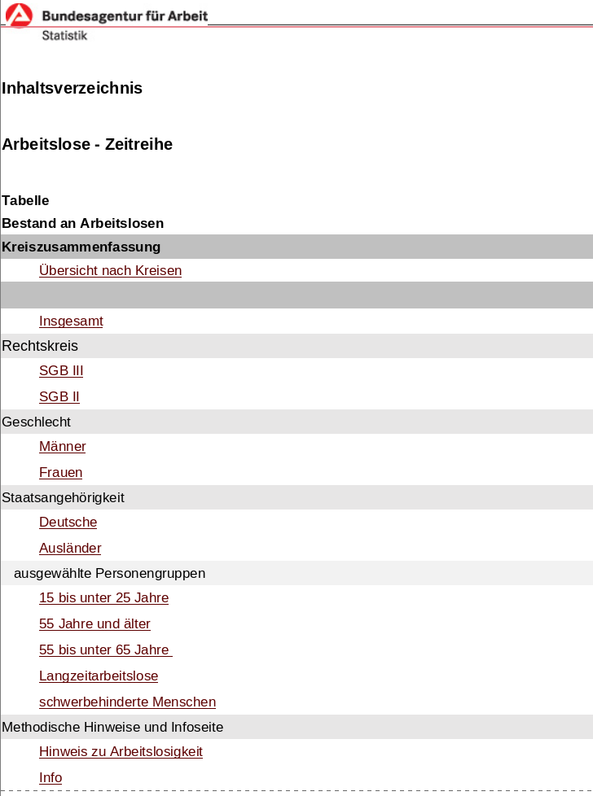
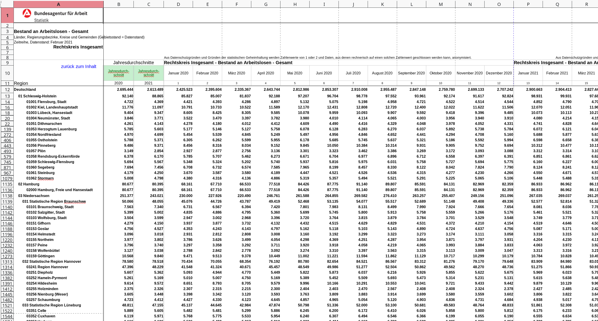
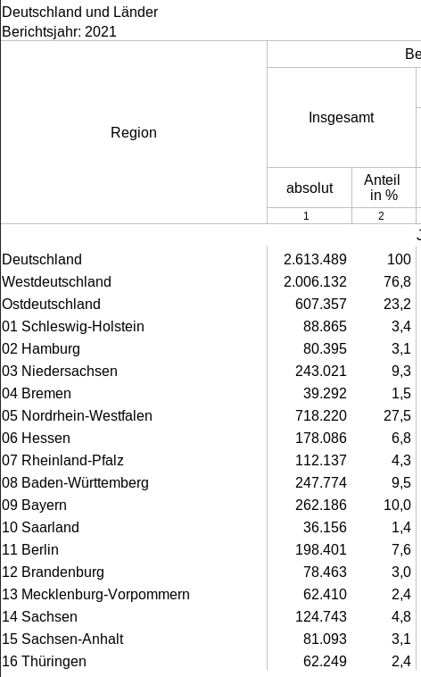

```{r setup, include=F}
#knitr::opts_chunk$set(fig.width = 6, message = F, warning = F, eval =F,
#                      comment = "", cache = F)
knitr::opts_chunk$set(fig.width = 6,  message = F, warning = F, eval = T, cache = F)
library(flipbookr)
library(knitr)
library(countdown)
```

```{css, eval = TRUE, echo = FALSE}
.remark-code{line-height: 1.5; font-size: 80%}
@media print {
  .has-continuation {
    display: block;
  }
}
```

# Ziel der Case-Study

Deutschland hat europaweit eine der niedrigsten Arbeitslosenquoten:

.pull-left[
```{r, echo=FALSE, out.width='70%'}

```

.supersmall[ Quelle: [Fleck, A. (August 11, 2022). The State of Unemployment in Europe (Digital image).](https://www.statista.com/chart/20834/unemployment-rates-eu-plus-uk/) ]

]

--

.pull-right[

.question[Doch gilt dies für alle Regionen in Deutschland?]

.question[Warum ist die Arbeitslosenquote in manchen Regionen höher als in anderen?]

.alert[Dem werden wir in dieser Case-Study auf den Grund gehen.]
]

---

# Ziele der Case Study

Diese Case-Study besteht aus **mehreren Teilen** und wird Sie durch die komplette Vorlesung als **konkretes Anschauungsobjekt** begleiten. 

Diese Case-Study dient als:
- konkretes und umfangreiches Beispiel für ein Projekt
- ökonomische und geographische Kenntnisse über Deutschland erhalten
- Beispiel wie statistische und programmiertechnische Kenntnisse in der empirischen Arbeit eingesetzt werden können

.instruction[In diesem Foliensatz nutze ich die magittr Pipe `%>%`, da dies mit dem Paket flipbookr nicht anders möglich ist. Es ist jedoch empfehlenswert grundsätzlich die Base R Pipe zu nutzen `|>`]

---

class: center, middle, inverse

# Datensätze herunterladen

---

## Ersten Teil der Case Study

- Daten einlesen
- Daten bearbeiten und in eine geeignete Form bringen ( `tidy` )

Anwenden auf 

- Daten zur Arbeitslosenstatistik
- Daten zur Verschuldung einzelner Landkreise bzw. Gemeinden
- Daten zum BIP

---

## Wichtig für die Datenbeschaffung


- Zuverlässige und qualitativ hochwertige Datenquellen ausfinding machen 
- Automatisierten Download programmieren
- Einlesen, verarbeiten und zusammenführen verschiedener Datensätze in R

--

Verbindung zum 2. RTutor Problem Set:

- **Im Problem Set:** Kennzahlen zu verschiedenen Ländern der europäischen Union 
- **Hier:** Kennzahlen innerhalb Deutschlands

--

.alert[Sowohl in der Case-Study als auch in den RTutor Problem Sets treffen Sie auf konkrete Probleme, die Sie mit ihren Kenntnissen aus der Vorlesung lösen sollen.]

---

## Daten beschaffen

Woher beziehen wir unsere Informationen?
--

-   Die Informationen über die Verschuldung der **Gemeinden** finden wir auf den Seiten des Statistischen Bundesamts im Report: [Integrierte Schulden der Gemeinden und Gemeindeverbände](https://www.statistikportal.de/de/veroeffentlichungen/integrierte-schulden-der-gemeinden-und-gemeindeverbaende).
-   Die Informationen zur Arbeitslosigkeit auf **Verwaltungsgemeinschaftsebene** finden wir auf den Seiten der [Bundesagentur für Arbeit](https://statistik.arbeitsagentur.de/DE/Navigation/Statistiken/Statistiken-nach-Regionen/BA-Gebietsstruktur-Nav.html).
-   Die Informationen zum BIP auf **Landkreisebene** finden wir auf den Seiten der [Statistischen Ämter des Bundes und der Länder](https://www.statistikportal.de/de/vgrdl).

--

.instructions[Zuverlässige und qualitativ hochwertige Datenquellen ausfinding machen] `r emo::ji("heavy_check_mark")`

---

## Daten herunterladen

- Daten können von URLs mit Befehlen aus den Paketen `readxl` und `readr` direkt eingelesen werden
  - Für Text und Excel-Dateien
- Allerdings, wenn URL nicht mehr verfügbar, was dann?
  - Daten immer mit `download.file()` herunterladen und in einem Unterordner `data` abspeichern!
  
--

.instructions[Automatisierten Download programmieren (wird in der ausformulierten Case-Study gemacht)] (`r emo::ji("heavy_check_mark")`)

--

.alert[Wir haben die Daten bereits im Github Repository `case-study-germany` heruntergeladen und abgespeichert. Klonen Sie dieses Repository von Github auf ihren PC!]

---

## Klonen Sie unsere Github Seite

- Gehen Sie auf die [Github Seite des Projektkurses](https://github.com/projektkurs-datascience/24-25)
- Klicken Sie auf des grünen "Code" Button
- Kopieren Sie sich die [angezeigte HTTPS](https://github.com/projektkurs-datascience/24-25.git)
- Gehen Sie in Github Desktop und fügen dort die kopierte HTTPS in "Clone a repository" -> "URL"

[Hier eine Step-by-Step Anleitung](https://docs.github.com/desktop/contributing-and-collaborating-using-github-desktop/adding-and-cloning-repositories/cloning-a-repository-from-github-to-github-desktop?platform=windows)

.alert[Wenn Sie zu Beginn der Woche in Github Desktop auf "Pull" klicken werden alle Vorlesungsinhalte automatisch aktualisiert, d.h. alle Vorlesungsfolien, die Case-Study, Tutorials etc.!]

```{r, echo=FALSE}
countdown(minutes = 5)
```

---


## Nötige Pakete laden

```{r pakete, message = T}
library(readxl)
library(skimr)
library(tidyverse)
```

--

.question[Was bedeuten die "Messages" nach dem Laden von library(tidyverse)?]


---

# Daten einlesen

Unterschiedliche Dateien und unterschiedliche Tabellenblätter, was sollten wir verwenden?

```{r}
# Öffnen des ZIP-Archivs
# Es sind zwei Tabellen in dem ZIP Archiv, wir interessieren uns für die Anzahl der Arbeitslosen und wählen diese mit dem kleinen [1] aus
alo_name <- as.character(unzip("../case-study/data/Arbeitslose_2022.xlsx.zip", list = TRUE)$Name)
alo_name <- alo_name[1]
unzip("../case-study/data/Arbeitslose_2022.xlsx.zip", alo_name)
```
--

**Vermutung:** Durch Tabellenblatt "Inhaltsverzeichnis" könnten wir schlauer werden

---

```{r}
alo_inhalt <- read_xlsx(alo_name, sheet = "Inhaltsverzeichnis")
head(alo_inhalt, 15)
```

---

```{r, eval=F}
alo_inhalt <- read_xlsx(alo_name, sheet = "Inhaltsverzeichnis")
head(alo_inhalt, 15)
```

```{r, message=FALSE, eval=FALSE}
## # A tibble: 15 × 1
##    Inhaltsverzeichnis     
##    <chr>                  
##  1 NA                     
##  2 NA                     
##  3 Arbeitslose - Zeitreihe
##  4 NA                     
##  5 NA                     
##  6 Tabelle                
##  7 Bestand an Arbeitslosen
##  8 Kreiszusammenfassung   
##  9 Übersicht nach Kreisen 
## 10 NA                     
## 11 Insgesamt              
## 12 Rechtskreis            
## 13 SGB III                
## 14 SGB II                 
## 15 Geschlecht 
```

---

```{r, eval=F}
alo_inhalt <- read_xlsx(alo_name, sheet = "Inhaltsverzeichnis")
head(alo_inhalt, 15)
```

.pull-left[
```{r, message=FALSE, eval=FALSE}
## # A tibble: 15 × 1
##    Inhaltsverzeichnis     
##    <chr>                  
##  1 NA                     
##  2 NA                     
##  3 Arbeitslose - Zeitreihe
##  4 NA                     
##  5 NA                     
##  6 Tabelle                
##  7 Bestand an Arbeitslosen
##  8 Kreiszusammenfassung   
##  9 Übersicht nach Kreisen 
## 10 NA                     
## 11 Insgesamt              
## 12 Rechtskreis            
## 13 SGB III                
## 14 SGB II                 
## 15 Geschlecht 
```
]

.pull-right[
```{r, echo = F, out.width='60%'}

```
]

**Alternative:** Schauen Sie sich die Excel-Datei in Excel oder LibreOffice an und entscheiden Sie dann, welches Tabellenblatt Sie einlesen möchten.

---

## Spezifizieren welche Spalten eingelesen werden sollen

Welche Information benötigen wir aus der Tabelle
  - Die Anzahl aller Arbeitslosen pro Gemeinde (d.h. SGB II und III gemeinsam) **aus dem Jahr 2022**
  - Die Anzahl der Arbeitslosen pro Gemeinde für einen bestimmten Rechtskreis (z.B. nur SGB II)
  - Die Anzahl der Arbeitslosen pro Gemeinde für einen bestimmten Rechtskreis und ein bestimmtes Alter (z.B. SGB II alle unter 25 Jahre)

---

## Spezifizieren welche Spalten eingelesen werden sollen

Welche Information benötigen wir aus der Tabelle
  - .alert[Die Anzahl aller Arbeitslosen pro Gemeinde (d.h. SGB II und III gemeinsam) **aus dem Jahr 2022**]
  - Die Anzahl der Arbeitslosen pro Gemeinde für einen bestimmten Rechtskreis (z.B. nur SGB II)
  - Die Anzahl der Arbeitslosen pro Gemeinde für einen bestimmten Rechtskreis und ein bestimmtes Alter (z.B. SGB II alle unter 25 Jahre)

--

.question[Was ist hier eine Beobachtung?]

---

```{r, out.width='150%', echo = F}

```

---

## Spezifizieren welche Spalten eingelesen werden sollen

Neben der Anzahl aller Arbeitslosen pro Gemeinde (d.h. SGB II und III gemeinsam) **aus dem Jahr 2022** benötigen wir noch die "Gemeinde-ID" und den Gemeindenamen.

Wie können wir die von uns benötigte Information möglichst einfach extrahieren?
--

- Der einfachste Weg: Die ersten acht Zeilen abzuschneiden und die Daten erst ab dort einzulesen.
- Anschließend behalten wir nur die ersten 3 Spalten

---

## Spezifizieren welche Spalten eingelesen werden sollen

`r chunk_reveal(chunk_name = "einlesen_alo")`

```{r einlesen_alo, include = F}
alo_skip <- read_xlsx(alo_name, sheet = "Gesamt", skip = 8)

alo_skip %>%
  select(c(`...1`, Jahresdurchschnitte, `...3`)) %>%
  mutate(Regionalschluessel = str_extract(`...1`, "[[:digit:]]+"),
         Gemeinde = str_extract(`...1`, "[A-Z].*")) %>%
  mutate(alo = as.numeric(`...3`)) %>%
  select(-c(`...1`, Jahresdurchschnitte, `...3`)) %>%
  filter(!is.na(alo))


```

```{r, echo=TRUE, eval=FALSE}
*#Abspeichern als Datensatz data_alo
  
*data_alo <- alo_skip %>% 
  select(c(`...1`, Jahresdurchschnitte, `...3`)) %>%
  mutate(Regionalschluessel = str_extract(`...1`, "[[:digit:]]+"),
         Gemeinde = str_extract(`...1`, "[A-Z].*")) %>%
  mutate(alo = as.numeric(`...3`)) %>%
  select(-c(`...1`, Jahresdurchschnitte, `...3`)) %>%
  filter(!is.na(alo))

data_alo <- data_alo[-c(1,2),]
```

```{r, echo=FALSE}
#ZIP-Datei schließen
unlink(alo_name)

#Abspeichern als Datensatz data_alo
  
data_alo <- alo_skip %>% 
  select(c(`...1`, Jahresdurchschnitte, `...3`)) %>%
  mutate(Regionalschluessel = str_extract(`...1`, "[[:digit:]]+"),
         Gemeinde = str_extract(`...1`, "[A-Z].*")) %>%
  mutate(alo = as.numeric(`...3`)) %>%
  select(-c(`...1`, Jahresdurchschnitte, `...3`)) %>%
  filter(!is.na(alo))

# Daten einlesen von Tabellenblatt Gesamt, ohne die ersten 8 Zeilen
# Nur die ersten drei Spalten (alle anderen Spalten sind immer ausgewählte Altersgruppen)
# "Regionalschluessel" aus dem Namen extrahieren
# Spalte `...3` in "alo"
# Löschen alle Zeilen, für die "alo" auf NA gesetzt 
# Wir speichern den Datensatz als `data_alo` ab

# Löschen der ersten zwei Zeile, die keine relevanten Angaben beinhalten (Also für ganz Deutschland)
data_alo <- data_alo[-c(1,2),]
```

---

## Konsistenzcheck

- Machen die Angaben Sinn und sind die Daten in sich konsistent?
- Externe Datenquelle suchen und intern auf konsistenz prüfen.
- Informationen aggregieren und mit anderen Quellen vergleichen
--

- Zunächst: Anzahl an Arbeitslosen für jedes **Bundesland** in 2022. 
  - zweistelligen `Regionalschluessel`
  - "Buchstaben" für jeden `Regionalschluessel` zählen (`nchar()` (number of characters))
- **Alternative Datenquelle:** [Die Anzahl der Arbeitslosen für das Jahr 2022 unterteilt nach Ländern der Arbeitsagentur](https://statistik.arbeitsagentur.de/Statistikdaten/Detail/202212/iiia4/akt-dat-jz/akt-dat-jz-d-0-202212-xlsx.xlsx)
  - Wichtig: Tabellenblatt 8

---

`r chunk_reveal(chunk_name = "konsistenz_alo")`

```{r konsistenz_alo, include = F, message = T, eval=F}
data_alo %>%
  filter(nchar(Regionalschluessel) == 2) %>%
  rename(bundesland = Regionalschluessel)
```

```{r, echo=FALSE}
check_alo_bundesland <- data_alo %>%
  filter(nchar(Regionalschluessel) == 2) %>%
  rename(bundesland = Regionalschluessel)
```

```{r, eval=F, echo=T}
*# Abspeichern als check_alo_bundesland

*check_alo_bundesland <- data_alo %>%
  filter(nchar(Regionalschluessel) == 2) %>%
  rename(bundesland = Regionalschluessel)
```

---

.pull-left[
```{r}
check_alo_bundesland
```

]

.pull-right[
```{r, out.width='65%', echo =F}

```

]

--

.center[.alert[Beide Datenreihen sind identisch]]

---

### Interne Konsistenz überprüfen

.instructions[Berechne: Anzahl an Arbeitslosen für jedes Bundesland als Summe der Arbeitslosen einer Gemeinde.]

```{r, eval=FALSE, echo=TRUE}
# Nur Gemeindedaten nutzen, dann auf Bundeslandebende die Summe aus den Gemeindedaten berechnen
alo_meta <- data_alo %>% 
  filter(nchar(Regionalschluessel) == 8) %>%
  mutate(landkreis = str_extract(Regionalschluessel, "^.{5}"),
         bundesland = str_extract(Regionalschluessel, "^.{2}"))

alo_bundesland <- alo_meta %>%
  group_by(bundesland) %>%
  summarise(total_alo = sum(alo))

alo_landkreis <- alo_meta %>%
  group_by(landkreis) %>%
  summarise(total_alo = sum(alo)) %>%
  rename(Regionalschluessel = landkreis)
```

---

`r chunk_reveal(chunk_name = "interne_konsistenz1")`

```{r interne_konsistenz1, include = F}
data_alo %>% 
  filter(nchar(Regionalschluessel) == 8) %>%
  mutate(landkreis = str_extract(Regionalschluessel, "^.{5}")) %>%
  mutate(bundesland = str_extract(Regionalschluessel, "^.{2}")) ->
alo_meta
```

---

`r chunk_reveal(chunk_name = "interne_konsistenz2")`

```{r interne_konsistenz2, include = F}
alo_meta %>%
  group_by(bundesland) %>%
  summarise(total_alo = sum(alo)) -> 
alo_bundesland
```

---

`r chunk_reveal(chunk_name = "interne_konsistenz3")`

```{r interne_konsistenz3, include = F}
alo_meta %>%
  group_by(landkreis) %>%
  summarise(total_alo = sum(alo)) %>%
  rename(Regionalschluessel = landkreis) -> 
alo_landkreis
```

---

### Interne Konsistenz überprüfen

Wir wollen nun die zwei Tabellen miteinander verbinden (besserer Überblick)

- Datensatz `check_alo_bundeland`: Auf Bundesland aggregierte Zahlen der Arbeitslosigkeit aus den Gemeinden
- Datessatz `alo_bundesland`: Die schon von der Arbeitsagentur aggregierte Zahlen in unserem Datensatz

---

`r chunk_reveal(chunk_name = "interne_konsistenz4")`

```{r interne_konsistenz4, include = F}
left_join(check_alo_bundesland, alo_bundesland, by = "bundesland") ->
  check_consitency

check_consitency %>%
  mutate(diff = alo - total_alo)
```
--

.center[.alert[Es bestehen keine Unstimmigkeiten.]]

---

class: inverse, middle, center

# Pro-Kopf Verschuldung

---

## Pro-Kopf Verschuldung auf Gemeindeebene

- Auf Gemeindeebene aus dem Jahr 2022
- Querschnittsdaten
- Vom Statistischen Bundesamt direkt als Excel-Tabelle heruntergeladen (`r emo::ji("heavy_check_mark")`)

.question[Welche Tabellenblätter sollten wir nutzen?]

```{r}
excel_sheets("../case-study/data/Schulden_2022.xlsx")
```

---

## Mehrere Tabellenblätter einlesen

- Nicht alle Informationen in **einem Tabellenblatt** enthalten
  - Viele separate Tabellenblätter
  - Hier müssen wir potentiell eine Operation über mehrere Tabellenblättern anwenden, z.B. durch eine Schleife

--

.instructions[Zuerst schauen wir jedoch welche Informationen wir benötigen anhand eines Beispiels:]

---

## Mehrere Tabellenblätter einlesen

```{r, message=FALSE}
sh <- read_xlsx("../case-study/data/Schulden_2022.xlsx", sheet = "SH")
head(sh,20)
```

---

## Mehrere Tabellenblätter einlesen

Wir benötigen:
- "Regionalschlüssel"
- "Gemeindename"
- "Einwohner"
- "Schuldes des öffentlichen Bereichs insgesamt"
- "Schulden je Einwohner"

Variablenbezeichnungen beginnen in Zeile 5, d.h. wir ignorieren die ersten 4 Zeilen beim Einlesen.

.question[Was ist hier eine Beobachtung?]

---

## Mehrere Tabellenblätter einlesen

Der Übersicht halber wollen wir noch eine Spalte hinzufügen, welche den Namen des Tabellenblattes enthält, welches wir gerade eingelesen haben.

```{r, eval=FALSE, message=FALSE, warning=FALSE}
# Einlesen des Tabellenblattes "SH" ohne die ersten 5 Zeilen und nur die Spalten 1-7
schulden_individuell <- read_xlsx("../case-study/data/Schulden_2022.xlsx", sheet = "SH", skip = 5)[1:7]
# Umbenennen der ersten 7 Spalten
colnames(schulden_individuell) <- c("Regionalschluessel", "Gemeinde", 
                                    "Verwaltungsform", "Einwohner", "Schulden_gesamt", "Veraenderung_Vorjahr", "Schulden_pro_kopf")

# Zusätzliche Spalte hinzufügen mit dem Namen des Tabellenblattes
*schulden_individuell$Bundesland <- "SH"
```

---

`r chunk_reveal(chunk_name = "schulden_einlesen")`

```{r schulden_einlesen, message=FALSE, warning=FALSE, include = F}
# Einlesen des Tabellenblattes "SH" ohne die ersten 5 Zeilen und nur die Spalten 1-7
read_xlsx("../case-study/data/Schulden_2022.xlsx", sheet = "SH", skip = 5)[1:7] ->
  schulden_individuell

# Umbenennen der ersten 7 Spalten
colnames(schulden_individuell) <- c("Regionalschluessel", "Gemeinde", 
                                    "Verwaltungsform", "Einwohner", "Schulden_gesamt", "Veraenderung_Vorjahr", "Schulden_pro_kopf")

# Zusätzliche Spalte hinzufügen mit dem Namen des Tabellenblattes
schulden_individuell$Bundesland <- "SH"

schulden_individuell
```

---

## Mehrere Tabellenblätter einlesen

.instructions[Formen Sie Teams von zwei Personen und erarbeiten Sie auf Basis des Beispiels für ein Bundesland einen Code um alle Bundesländer in R einzulesen.]

.alert[Nutzen Sie für diese Aufgabe **bwGPT**.]

Posten Sie ihren Code hier:

```{r, echo = F, out.width='30%'}

```

```{r, echo=FALSE}
countdown(minutes = 10)
```

---

## Variablen umformen

```{r, eval =T, echo = F}
# Daten mit map_df() eine Vektorisierte Form um die Daten einzulesen (Struktur gleich wie im vorherigen Chunk)
sheet_names <- excel_sheets("../case-study/data/Schulden_2022.xlsx")
# Einlesen der Tabellenblätter 6-18 (alle Bundesländer)
sheet_read <- sheet_names[6:18]

# Vektorisierte Form mit purrr::map_df() um die unterschiedlichen Tabellenblätter einzulesen und die Daten zu einem Datensatz zusammenzufügen
schulden_individuell <- map_df(sheet_read, function(sheet) {
  tmp <- read_xlsx("../case-study/data/Schulden_2022.xlsx", sheet = sheet, skip = 5)[1:7]
  tmp$Bundesland <- sheet
  colnames(tmp) <- c("Regionalschluessel", "Gemeinde", "Verwaltungsform", 
                     "Einwohner", "Schulden_gesamt", "Veraenderung_Vorjahr", "Schulden_pro_kopf", "Bundesland")
  return(tmp)
})
```

```{r}
head(schulden_individuell,15)
```

---

## Variablen umformen

Wir sehen, es gibt immer noch einige Probleme:

- Die Werte unserer Variablen stehen nicht direkt unter dem Variablennamen 
  - Dies können wir am einfachsten bereinigen indem wir alle `NA`s im Regionalschlüssel entfernen 
--

- Die Variablen "Einwohner", "Schulden_gesamt" und "Schulden_pro_Kopf" sind alle als `character` hinterlegt (`<chr>` unter dem Variablennamen in der vorherigen Tabelle)
  - Beispiel warum Klasse `character` (Zeile 28): Es sind geschweifte Klammern enthalten

```{r}
schulden_individuell[28,]
```

--

- Definition einer Variablen `landkreis`: Ersten 5 Zeichen im Regionalschlüssel

---


`r chunk_reveal(chunk_name = "schulden_umformen")`

```{r schulden_umformen, message=FALSE, include = F}
# Die Daten wurden noch nicht schön eingelesen, in der Excel Tabelle 
# waren die Variablennamen über mehrere Reihen gezogen, dies müssen wir noch ausgleichen
schulden_individuell %>%
  filter(!is.na(Regionalschluessel)) %>%
  mutate(Schulden_gesamt = as.numeric(Schulden_gesamt)) %>%
  mutate(Einwohner = as.numeric(Einwohner)) %>%
  mutate(Schulden_pro_kopf = as.numeric(Schulden_pro_kopf)) %>%
  mutate(landkreis = str_extract(Regionalschluessel, "^.{5}")) %>%
  select(-Veraenderung_Vorjahr) %>%
  #manche Landkreise haben keine Infos zu den Einwohnern, diese entfernen wir
  filter( !is.na( Einwohner )) ->
schulden_bereinigt

```


---

class: middle, inverse, center

# Konsistenzcheck zum Schulden-Datensatz

---

## Interne Validität Schulden pro Kopf

- `Schulden_pro_Kopf_new` von Hand berechnen
- **Beachte:**
  - Geschweiften Klammern entfernen bei `Schulden_gesamt` (mit `gsub([{}])`), als auch die Leerzeichen innerhalb der Zahlen (z.B. 15 653), was wir mit `gsub("[[:space:]]")` erreichen. 
  - Tun wir das nicht, so würden wir wieder `NA`s im Datensatz erhalten

.tiny[

```{r, warning=FALSE, message=FALSE, eval=FALSE}
# Erstellen der Vergleichstabelle
schulden_consistency <- schulden_individuell %>%
  filter(!is.na(Einwohner) & !is.na(Regionalschluessel)) %>%
  mutate(
    Einwohner_num = as.numeric(gsub("[[:space:]{}]", "", Einwohner)),
    Schulden_gesamt = as.numeric(gsub("[[:space:]{}]", "", Schulden_gesamt)),
    Schulden_pro_kopf = as.numeric(gsub("[[:space:]{}]", "", Schulden_pro_kopf)),
    Schulden_pro_kopf_new = round(Schulden_gesamt / Einwohner_num, 2),
    landkreis = str_extract(Regionalschluessel, "^.{5}"),
    differenz = Schulden_pro_kopf - Schulden_pro_kopf_new
  ) %>%
  relocate(Regionalschluessel, Einwohner, Einwohner_num, Schulden_pro_kopf, Schulden_pro_kopf_new)

```

]

--

.question[Was macht **gsub()** und **str_extract()** hier genau? Und was sind **reguläre Ausdrücke**?]

---

`r chunk_reveal(chunk_name = "schulden_konsistenz")`

```{r schulden_konsistenz, message=FALSE, warning=FALSE, include = F}
# Erstellen der Vergleichstabelle
schulden_individuell %>%
  filter(!is.na(Einwohner) & !is.na(Regionalschluessel)) %>%
  mutate(
    Einwohner_num = as.numeric(gsub("[[:space:]{}]", "", Einwohner)),
    Schulden_gesamt = as.numeric(gsub("[[:space:]{}]", "", Schulden_gesamt)),
    Schulden_pro_kopf = as.numeric(gsub("[[:space:]{}]", "", Schulden_pro_kopf)),
    Schulden_pro_kopf_new = round(Schulden_gesamt / Einwohner_num, 2),
    landkreis = str_extract(Regionalschluessel, "^.{5}"),
    differenz = Schulden_pro_kopf - Schulden_pro_kopf_new
  ) %>%
  relocate(Regionalschluessel, Einwohner, Einwohner_num, Schulden_pro_kopf, Schulden_pro_kopf_new) -> 
schulden_consistency
```


---

## Interne Validität Schulden pro Kopf

```{r}
range(schulden_consistency$differenz, na.rm=TRUE)
```

--

.alert[Die Differenzen liegen zwischen +/- 50 Cent]

---

## Interne Validität Schulden pro Kopf

Es gibt keine nicht verfügbaren Werte, was gut ist bzgl. der internen Validität.

```{r}
filter(schulden_consistency, is.na(differenz))
```


---

class: center, middle, inverse

# Bruttoinlandsprodukt

---

## Informationen bzgl. des Bruttoinlandsprodukts

Nach dem Download bei den Statistischen Ämtern des Bundes und der Länder und einer ersten Betrachtung interessieren uns folgende Tabellenblätter:

- Betrachten der Daten 
  - Tabellenblatt "1.1" ist für unsere Analyse ausschlaggebend (für das BIP)
  - Tabellenblatt "3.1" ist für die Anzahl an Erwerbstätigen ausschlaggebend
  - Tabellenblatt "5" ist für die Anzahl an Einwohnern ausschlaggebend
- Die ersten vier Zeilen benötigen wir nicht
- Die letzte Zeile enthält eine kurze Beschreibung die wir nicht benötigen 
  - **Lösung:** Behalte alle Zeilen, welche bei der `Lfd. Nr.` numerisch sind
- Die folgenden Variablen benötigen wir nicht für unsere Analyse und können entfernt werden: `Lfd. Nr.`, `EU-Code`, `NUTS 1`, `NUTS 2`, `NUTS 3`, `Land`, `Gebietseinheit`

---

## Informationen bzgl. des Bruttoinlandsprodukts

```{r, warning=FALSE, message=FALSE}
# Blatt 1.1 einlesen und die ersten 4 Zeilen skippen
bip <- read_xlsx("../case-study/data/BIP_2023.xlsx", sheet="1.1", skip = 4)
erwerb <- read_xlsx("../case-study/data/BIP_2023.xlsx", sheet="3.1", skip = 4)
einwohner <- read_xlsx("../case-study/data/BIP_2023.xlsx", sheet = "5", skip = 4)
```

---

`r chunk_reveal(chunk_name = "bip_einlesen1")`

```{r bip_einlesen1, message=FALSE, warning=FALSE, include = F}
# Zeile löschen in der die `Lfd. Nr.` nicht nummerisch ist
# Zusätzliche Spalten löschen
bip %>% 
  filter(is.na(as.numeric(`Lfd. Nr.`))==FALSE) %>%
  select(-c(`Lfd. Nr.`, `EU-Code`, `NUTS 1`, `NUTS 2`, `NUTS 3`, Land, Gebietseinheit)) %>%
  rename(Regionalschluessel = `Regional-schlüssel`) ->
bip_wide 
```

---

## Informationen bzgl. des Bruttoinlandsprodukts

.question[Was ist hier eine Beobachtung?]

--

Entsprechend können wir bei den Erwerbstätigen und den Einwohnern vorgehen:

```{r bip_einlesen2, message=FALSE, warning=FALSE}
# Zeile löschen in der die `Lfd. Nr.` nicht nummerisch ist
# Zusätzliche Spalten löschen
erwerb_wide <- erwerb %>% 
  filter(is.na(as.numeric(`Lfd. Nr.`))==FALSE) %>%
  select(-c(`Lfd. Nr.`, `EU-Code`, `NUTS 1`, `NUTS 2`, `NUTS 3`, Land, Gebietseinheit)) %>%
  rename(Regionalschluessel = `Regional-schlüssel`)

einwohner_wide <- einwohner %>%
  filter(is.na(as.numeric(`Lfd. Nr.`))==FALSE) %>%
  select(-c(`Lfd. Nr.`, `EU-Code`, `NUTS 1`, `NUTS 2`, `NUTS 3`, Land, Gebietseinheit)) %>%
  rename(Regionalschluessel = `Regional-schlüssel`)
```

---

## Informationen bzgl. des Bruttoinlandsprodukts

Datensatz,  
  - ist ein Panel: Mehrere Jahre für mehrere Landkreise in Deutschland vorhanden
  - ist im `wide` Format -> d.h. die Daten sind nicht `tidy`

  
```{r, warning=FALSE, message=FALSE}
head(bip_wide, 3)
```

--

.question[Was sind die Bedigungen für einen `tidy` Datensatz?]

---

## Daten in das `long`-Format überführen

Datensatz ins `long`-Format überführen mit `pivot_longer`:

```{r, eval=FALSE}
bip_long <- pivot_longer(bip_wide, cols = c("1992":"2022") , names_to = "Jahr", values_to = "BIP")
```

```
Fehler: Can't combine `1992` <character> and `2000` <double>.
```

---

## Daten in das `long`-Format überführen

BIP sollte normalerweise nummerisch sein:
  - Klasse `double` sollte korrekt sein
  - umformatieren der Spalten `1992` - `1999`
  - mit `across()` kann der `mutate()`-Befehl über mehrere Spalten angewendet werden

---

`r chunk_reveal(chunk_name = "double")`

```{r double, message=FALSE, warning=FALSE, include = F}
#BIP von 1992 - 1999 umformen (als numerische Variable)
bip_wide %>%
  select(`1992`:`1999`) %>%
  mutate(across(is.character, as.double)) ->
bip_double
```

---

Entsprechend dann bei den Einwohnern und Erwerbstätigen:

.question[Es wird eine Warnmeldung ausgegeben das `NA`s bei der Umwandlung erzeugt wurden. Warum?]

```{r, message=FALSE, warning=TRUE}
# Erwerbstätige von 1992 - 1999 umformen (als numerische Variable)
erwerb_double <- erwerb_wide %>%
  select(`1992`:`1999`) %>%
  mutate(across(is.character, as.double))

# Einwohner von 1992 - 1999 umformen (als numerische Variable)
einwohner_double <- einwohner_wide %>%
  select(`1992`:`1999`) %>%
  mutate(across(is.character, as.double))
```

---

## Daten in das `long`-Format überführen

Wir überprüfen, welche Spalten die Warnung hervorgerufen haben und wo `NA`s erzeugt wurden

```{r, message=FALSE, warning=FALSE}
bip_wide_test <- bip_wide %>%
  bind_cols(bip_double)

head(filter(bip_wide_test, is.na(`1992...32`)))
```

---

Eine Umwandlung zu `NA` geschieht bei den Werten bei denen `-` eingetragen wurde. D.h. für uns ist es ok hier ein `NA` einzutragen.
Somit können wir die Umwandlung in die Klasse `double` durchführen:

```{r, message=FALSE, warning=FALSE}
bip_wide <- bip_wide %>%
  select(-(`1992`:`1999`)) %>%
  bind_cols(bip_double) 

erwerb_wide <- erwerb_wide %>%
  select(-(`1992`:`1999`)) %>%
  bind_cols(erwerb_double) 

einwohner_wide <- einwohner_wide %>%
  select(-(`1992`:`1999`)) %>%
  bind_cols(einwohner_double) 
```

---

## Daten in das `long`-Format überführen

Nun können wir den Datensatz ins `long`-Format transferieren und nach dem Jahr sortieren.

- Einwohner und Erwerbstätige sind in 1000 Personen angegeben, daher Erwerbstätige und Einwohner mit 1000 multiplizieren. 
- BIP ist in 1 Mio. Euro angegeben, daher die Multiplikation mit 1 Mio.

---

`r chunk_reveal(chunk_name = "long")`

```{r long, message=FALSE, warning=FALSE, include = F}
# BIP ins long-Format
pivot_longer(bip_wide, cols = c("2000":"1999") , names_to = "Jahr", values_to = "bip") %>%
  mutate( Jahr = as.numeric(Jahr),
          bip = bip * 1000000) %>%
  arrange( Jahr ) ->
bip_long
```

---

Für die Erwerbstätigen und Einwohner entsprechend:

```{r, message=FALSE, warning=FALSE}
# Anzahl der Erwerbstätigen ins long-Format
erwerb_long <- pivot_longer(erwerb_wide, cols = c("2000":"1999") , names_to = "Jahr", values_to = "erw") %>%
  mutate( Jahr = as.numeric(Jahr),
          erw = erw * 1000) %>%
  arrange( Jahr )

# Anzahl der Einwohner ins long-Format
einwohner_long <- pivot_longer(einwohner_wide, cols = c("2000":"1999") , names_to = "Jahr", values_to = "einwohner") %>%
  mutate( Jahr = as.numeric(Jahr),
          einwohner = einwohner * 1000) %>%
  arrange( Jahr )
```

---

## Konsistenzchecks

Hier sollten Sie selbst aktiv werden und die Daten auf Konsistenz prüfen:

.instructions[Als Konsistenzcheck könnten Sie hier die Anzahl der Einwohner aus den verschiedenen Datensätzen vergleichen.]

---

# Kartenmaterial hinzufügen 

Wir benötigen hier eine Karte von Deutschland mit den einzelnen Verwaltungsgrenzen als SHAPE-File und können diese mittels des `sf`-Pakets einlesen.

Das [OpenData Portal des Bundesamts für Kartographie und Geodäsie](https://gdz.bkg.bund.de/index.php/default/open-data/verwaltungsgebiete-1-250-000-ebenen-stand-01-01-vg250-ebenen-01-01.html) stellt die nötigen Informationen kostenlos zur Verfügung.

[Die Dokumentation der Daten](https://sg.geodatenzentrum.de/web_public/gdz/dokumentation/deu/vg250.pdf) sollten wir uns immer zuerst anschauen, bevor wir die Datenquelle herunterladen. 

.center[.alert[Dies gilt nicht nur für die Geodaten, sondern allgemein für alle Datenreihen.]]

.instructions[Bitte versuchen Sie selbst die Daten herunterzuladen und anhand des Regionalschlüssels (ARS) mit dem BIP, den Arbeitslosen und den Schulden zusammenzuführen.]

---

# Datensätze zusammenführen

.instructions[Nun möchten wir die unterschiedlichen Datensätze noch zu einem zusammenfügen!]

Zuerst müssen wir folgende Schritte unternehmen:
- Informationen zur Verschuldung auf Landkreisebene aggregieren 
- Daten zum BIP auf das Jahr 2022 einschränken. 
- Datensätze anhand des Regionalschlüssels miteinander verbinden.

Weiterhin können wir die geografischen Daten separat abspeichern und bei Bedarf anhand des Regionalschlüssels zu unserem Datensatz hinzumergen.

---

`r chunk_reveal(chunk_name = "kombi1")`

```{r kombi1, message=FALSE, warning=FALSE, include = F}
# Schulden auf Landkreisebene
schulden_bereinigt %>%
  group_by(landkreis) %>%
  summarise( Schulden_pro_kopf_lk = sum(Schulden_gesamt)/sum(Einwohner), 
             Einwohner = sum(Einwohner), 
             Schulden_gesamt = sum(Schulden_gesamt)) %>%
  ungroup() %>%
  rename(Regionalschluessel = landkreis) ->
schulden_kombi
```

---

`r chunk_reveal(chunk_name = "kombi2")`

```{r kombi2, message=FALSE, warning=FALSE, include = F}

# Anzahl an Erwerbstätigen für das Jahr 2022
erwerb_long %>%
  filter(nchar(Regionalschluessel) == 5 & Jahr == 2022) %>%
  select(-Jahr) ->
erwerb_kombi
```

---

`r chunk_reveal(chunk_name = "kombi3")`

```{r kombi3, message=FALSE, warning=FALSE, include = F}
# Anzahl an Einwohner für das Jahr 2022
einwohner_long %>%
  filter(nchar(Regionalschluessel) == 5 & Jahr == 2022) %>%
  select(-Jahr) ->
einwohner_kombi
```

---

`r chunk_reveal(chunk_name = "kombi4")`

```{r kombi4, message=FALSE, warning=FALSE, include = F}
# Anzahl der Einwohner mit dem BIP verbinden um das BIP pro Kopf berechnen zu können
left_join(bip_long, einwohner_long, by=c("Regionalschluessel", "Jahr")) %>%
  mutate(bip_pro_kopf = bip / einwohner) %>%
  # BIP auf Landkreisebene
  filter(nchar(Regionalschluessel) == 5 & Jahr == 2022) %>%
  select(-c(Jahr, einwohner)) ->
bip_kombi
```

---

`r chunk_reveal(chunk_name = "kombi5")`

```{r kombi5, message=FALSE, warning=FALSE, include = F}
# Datensätze zusammenführen

# Basisdatensatz -> Arbeitslosenzahlen pro Landkreis
# Namen der Bundesländer zumergen
alo_landkreis %>% 
  mutate(bundesland = str_extract(Regionalschluessel, "^.{2}")) %>%
  left_join(., schulden_kombi, by = "Regionalschluessel") %>%
  left_join(., bip_kombi, by = "Regionalschluessel") %>%
  # Zahl der Erwerbstätigen zumergen
  left_join(., erwerb_kombi, by = "Regionalschluessel") ->
gesamtdaten

#saveRDS(gesamtdaten, "data/gesamtdaten.rds")
#saveRDS(schulden_bereinigt, "data/schulden_bereinigt.rds")
#saveRDS(bip_zeitreihe, "data/bip_zeitreihe.rds")
```

---

# Übungsaufgaben

Laden Sie sich das durchschnittliche [Arbeitnehmerentgelt pro Arbeitnehmer und Landkreis](https://www.statistikportal.de/de/veroeffentlichungen/arbeitnehmerentgelt) auf der Seite der Statistischen Ämter des Bundes und der Länder herunter und lesen Sie diesen in R ein.

- Bilden Sie ein Team von 4-5 Personen
- Nutzung der Case-Study und bwGPT um die Aufgaben zu erledigen

**Aufgabe:**

- Finden Sie in dem heruntergeladenen Datensatz heraus, was der Unterschied zwischen *Arbeitnehmerentgelt* und *Bruttolöhne- und Gehälter* ist.
- Lesen Sie die für Sie relevante Tabelle *Bruttolöhne- und Gehälter* in R ein.
- Bereinigen Sie die Tabelle, d.h. der Datensatz sollte danach `tidy` sein.
- Berechnen Sie die Bruttolöhne pro Bundesland mit den Bruttolöhnen der einzelnen Landkreise als Konsistenzcheck.
- Vergleichen Sie ihren Datensatz mit dem auf Github bereitgestellten Datensatz ("einkommen.rds"). Stimmen diese überein?
- Verbinden Sie die Informationen zu den durchschnittlichen Einkommen mit dem *gesamtdatensatz* aus dem vorherigen Abschnitt.

```{r, echo=FALSE}
countdown(minutes = 20)
```

---

## Hinweise zum Prompting von bwGPT

.pull-left[
**Wie sollte ein Prompt aufgebaut sein?**

- **Aufgabe:** Was soll ChatGPT tun? 
    - Möglichst genau und spezifisch sein
- **Instruktionen:** Wie soll ChatGPT es tun?
    - Soll ChatGPT eine besondere Persona sein?
    - Beispiele für den gewünschten Output mitgeben
    - ChatGPT fragen zur Lösung Schritt-für-Schritt zu kommen
- **Kontext:** Was sollte ChatGPT zu seiner Aufgabe wissen?
    - Wie passt die Aufgabe z.B. zur Vorlesung die Sie gerade besuchen?
]

.pull-right[
**Wenn Sie nicht weiter wissen, dann Fragen Sie ChatGPT welche Infos es noch benötigt**

- "Sag mir, welche Informationen du benötigst, um ...“
- "Stelle mir 5 Fragen, die dir helfen werden, mir die bestmögliche Antwort zu geben."
  	
**Wenn Sie glauben ChatGPT hat einen Fehler gemacht, dann sagen Sie ihm dies**

**Komplexe Aufgaben in kleine Unteraufgaben herunterbrechen**
]

