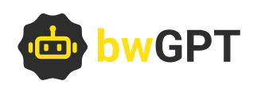

```{r setup, include=FALSE}
options(htmltools.dir.version = FALSE)
knitr::opts_chunk$set(warning = FALSE, message = FALSE, 
  comment = NA, dpi = 300,
  fig.align = "center", out.width = "70%", cache = FALSE)
library(tidyverse)
library(here)
library(knitr)
#devtools::install_github("hadley/emo")
library(emo)
library(extrafont)
library(png) 
library(xaringan)
library(countdown)

ggplot2::theme_set(theme_minimal())
# update those defaults
update_font_defaults <- function(font_choice = "Lato") {
    ggplot2::update_geom_defaults("text", list(family = font_choice))
    ggplot2::update_geom_defaults("label", list(family = font_choice))
    
}
theme_bakeoff <- function(font_choice = "Lato"){ 
  
  update_font_defaults()
  
  ggplot2::theme_minimal(base_family = font_choice)
  
}
ggplot2::theme_set(theme_bakeoff())
```


# Mit wem haben Sie es zu tun?

## Ihr Dozent und Übungsleiter

.pull-left[
<br><br>
**Dozent**

Dr. Alexander Rieber

<a href="mailto:alexander.rieber@uni-ulm.de"><i class="fa fa-paper-plane fa-fw"></i>&nbsp; alexander.rieber@uni-ulm.de</a><br>

Büro: Helmholtzstraße 18, Raum 1.22
]

.pull-right[
<br><br>
**Übungsleiter**

Dennis Steinle

<a href="mailto:dennis.steinle@uni-ulm.de"><i class="fa fa-paper-plane fa-fw"></i>&nbsp; dennis.steinle@uni-ulm.de</a>

Büro: Helmholtzstraße 18, Raum 1.10
]

---

## Ihre Tutor:innen

.pull-left[
<br><br>
**Tutor**

Judith Sulz

<a href="mailto:judith.sulz@uni-ulm.de"><i class="fa fa-paper-plane fa-fw"></i>&nbsp; judith.sulz@uni-ulm.de</a>

<br><br>
**Tutor**

Leonard Pöhls

<a href="mailto:leonard.poehls@uni-ulm.de"><i class="fa fa-paper-plane fa-fw"></i>&nbsp; leonard.poehls@uni-ulm.de</a>
]

.pull-right[
<br><br>
**Tutor**

Pius Schöler

<a href="mailto:pius.schoeler@uni-ulm.de"><i class="fa fa-paper-plane fa-fw"></i>&nbsp; pius.schoeler@uni-ulm.de</a>

<br><br>
**Tutor**

Frederick Sollors

<a href="mailto:frederick.sollors@uni-ulm.de"><i class="fa fa-paper-plane fa-fw"></i>&nbsp; frederick.sollors@uni-ulm.de</a>
]

---
class: inverse, center, middle

# Vorlesungsdetails

---

## Aufbau der Veranstaltung

- Interaktive Vorlesung mit Übungsaufgaben
  - In den ersten 5 Wochen
  - Mittwochs von 8:30 Uhr - 10:00 Uhr in H20
  - Freitags von 10:15 Uhr - 11:45 Uhr in H14
- `RTutor` Übungsaufgaben um Inhalte zu vertiefen
- Ein gemeinsames Projekt mit dem Dozenten
- Zwei selbstständige Projekte
- Peer Review der selbstständigen Projekte
- Probeklausur am 23.05.2025 in der Vorlesung! (Anwesenheitspflicht da Vorleistung)
  - Keine Hilfsmittel erlaubt und mind. 20% korrekten Fragen als Bestehensgrenze

---

## Wo finden Sie die Kursmaterialien?

.center[.instructions[Unserer Kommunikation mit Ihnen erfolgt über unsere Moodle Seite]]

Auf dieser Moodle Seite finden Sie:

--
- Vorlesungsplaner als Übersicht der wichtigsten Termine/Abgaben `r emo::ji("calendar")`

--
- Vorlesungsfolien `r emo::ji("spiral_notepad")`

--
- Lehrvideos `r emo::ji("video")`

--
- RTutor Problem Sets -> `RTutor`

--
- Aufgabenstellungen für die einzelnen Projekte `r emo::ji("book")`

--
- Forum für Fragen `r emo::ji("man_student")` `r emo::ji("woman_student")` `r emo::ji("exclamation_question_mark")`

--

Bis zum 21. Mai werden Vorlesungen in Form von Präsenzvorlesungen, Lehrvideos, Tutorials und RTutor Problem Sets stattfinden.
Weiterhin wird eine Projektarbeit innerhalb der Vorlesung mit ihnen gemeinsam erarbeitet. (Gibt 10% der Endnote)

--
.center[.alert[Anschließend gibt es zwei selbstständige Projektarbeiten, welche in die Endnote einfließen werden.]]

---

## Interaktive Vorlesung

- Interaktive Vorlesung mit integrierten Übungsaufgaben
- Geblockte Vorlesungseinheiten zu Beginn des Semesters
- Präsenzlehre, (alte Vorlesungsaufzeichnungen werden bereit gestellt), dient der praktischen Anwendung aus den Lehrvideos
  - **Anders als im letzten Semester** werden diese Vorlesungseinheiten hauptsächlich theoretische Inhalte präsentieren
  - Case-Study wird in der Einheit zur linearen Regression näher beleuchten
  - Kausale Effekte werden anhand eines Experiments und einer Instrumentalvariablenschätzung aufgezeigt
  - Grundkonzepte des maschinellen Lernens werden eingeführt
- RTutor Problem Sets und Tutorials sollen zum "learning-by-doing" anregen

---
class: inverse, middle, center

# Was Sie in dieser Vorlesung lernen

---

## Was haben Sie im ersten Teil des Projektkurses gelernt?

--

- (Große) Datenmengen einlesen, bearbeiten und aus verschiedenen Datenquellen zusammenführen

--
- Mit diversen Problemen rund um die Datenaufbereitung umgehen

--
- Zusammenarbeit im Team + Versionierung über Github

--
- Regeln zur Erstellung geeigneter Grafiken und Tabellen um ihre Analyse zu untermauern

--
- Transparente und reproduzierbare Analysen mit RMarkdown erstellen

--
- Selbstständig nach Lösungen für Probleme bei empirischen Problemen zu suchen

--
- (Kritische) Bewertung anderer Gruppen über einen Review Report

--

.center[.alert[Das letzte Semester war eher technisch (programmierlastig) ausgelegt und auf deskriptive Analysen beschränkt.]]

---

## Was werden Sie im zweiten Teil des Projektkurses lernen?

--

- Wahrscheinlichkeitsrechnung (kurz)
--

- (Multivariate) Lineare Regression
--

- Interpretation von Schätzern
--

- Kausale Zusammenhänge aufdecken
  - In Experimenten
  - In Beobachtungsdaten
--

- Konzept der Kausalität in Beobachtungsdaten mittels directed acyclical graphs (DAG)

--
- Instrumentalvariablenschätzung

--
- Grundkonzepte des maschinellen Lernens

--

.center[.alert[Dieses Semester werden Sie ihre ökonometrischen Kenntnisse vertiefen!]]

---

## Ziele für dieses Semester

Nach diesem Semester werden Sie in der Lage sein:

--
- Regressionstabellen zu lesen und die jeweiligen Schätzer zu interpretieren

--
- Die (statistische) Signifikanz von Schätzern zu beurteilen

--
- Hypothesen abzuleiten und eigene Fragenstellungen mittels statistischer Analysen zu beantworten

--
- Zu verstehen, wann Sie ihre Ergebnisse kausal interpretieren können

--
- Einen Überblick über die Konzepte des maschinellen Lernens geben können

---

class: inverse, center, middle

# Übungsaufgaben mit `RTutor`

---

## Wie Sie die Vorlesungsinhalte vertiefen

- Wöchentliche `RTutor` Problem Sets, welche die Unterrichtseinheit aufgreifen und vertiefen
- _Individuelle_ Abgabe der `RTutor` Problem Sets als **Vorleistung** 
   - Insgesamt 3 `RTutor` Problem Sets müssen bearbeitet werden
   - In jedem `RTutor` Problem Set müssen Sie mind. 80% der Gesamtpunkte erreichen

--

Die `RTutor` Problem Sets behandeln vorlesungsbegleitend folgende Inhalte:

- Regressionsanalysen in R
- Kausalität in Experimenten
- Kausalität in Beobachtungsdaten

---

class: inverse, center, middle

# Gruppenzusammensetzung

---

## Gruppenzusammensetzung

- Die Gruppen werden **auf der Basis eines Fragebogens zugeteilt**
- Es werden immer Gruppen von 3 Personen gebildet
- Die Gruppenzusammensetzung gilt für **ein selbstständiges Projekt**
- Die Gruppe bekommt **eine Note** für **alle Gruppenmitglieder**
  - Teamwork ist angesagt, mit der entsprechenden Koordination im Team

Wir **teilen** die Gruppen den **Tutorien zu**. Das Tutorium gilt für das jeweilige Projekt.

--

Voraussetzung zur Teilnahme am 2. Teil des Projektkurses in diesem SoSe 25:
- Erster Teil des Projektkurses im WiSe 24/25 bestanden

---

class: inverse, center, middle

# Unterstützungsangebote

---

## Wo bekommen Sie Hilfe?

- Auf Moodle gibt es wieder ein Diskussionforum, scheuen Sie sich nicht dort ihre Fragen zu stellen!
    - Bitte benutzen Sie dieses Forum, bevor Sie eine Mail an den Tutor, Übungsleiter oder Dozent stellen
    - Wir haben einige Beispiele aufgearbeitet, wie Sie Fragen stellen können, auf die Sie schnell antworten erhalten. [Das Dokument finden Sie hier](https://projektkurs-data-science-ulm2425.netlify.app/tutorials/fragen-im-forum)

.alert[Insbesondere während der Vorlesungsphase ist das Moodle Forum sehr wichtig um allgemeine Fragen zu klären!]

--
- Es finden parallel zu den Projektarbeiten Tutorien statt, die Zuteilung der Tutoriumstermine erfolgt in der zweiten Hälfte der Veranstaltung

---

## Tutorium

- Ab der 6. Vorlesungswoche gibt es ein vorlesungsbegleitendes Tutorium.
  - Die Termine werden auf Moodle bekannt gegeben
- Die Tutorien werden wöchentlich als Online-Tutorien stattfinden, hierfür haben wir Gruppenarbeitsräume erstellt
- Es wird wieder einen **Kick-off Tutorium** für jede Gruppe geben, welcher in der Woche vor dem Start des jeweiligen Projekts stattfindet
- Die Tutor:innen beantworten auch ihre Fragen auf Moodle
  - Bitte stellen Sie ihre Fragen im Forum, wenn ihr Problem allgemeiner Natur ist

--

.instructions[Das Tutorium soll hauptsächlich dazu dienen Sie bei ihren individuellen Projektausarbeitungen zu unterstützen!]

---

## LLMs in der Vorlesung und den Projekten

.pull-left[
```{r, echo=F}

```
]

.pull-right[
Im letzten Semester haben wir an dem baden-württembergischen Pilotprojekt [bwGPT](https://www.zml.kit.edu/bwgpt.php) teilgenommen. Sie haben noch bis Ende Mai Zugriff auf diese Plattform.

**Vorteil für Sie:** Sie erhalten einen datenschutzrechtlich sicheren Zugriff auf ChatGPT (und andere LLMs) im Rahmen dieser Vorlesung

- Integration von LLMs in den Lernprozess
- Nutzung von LLMs in der Vorlesung und in den Projekten
- Kennenlernen von LLMs im akademischen Kontext (Ethik und rechtliche Einschränkungen)

Über [diesen Link](https://bwgpt.scc.kit.edu/login) können Sie sich bei bwGPT mit ihrem KIZ-Account anmelden.
]

---
class: inverse, center, middle

# Mit welchen Daten bekommen _Sie_ es zu tun?

---

## Case-Study: Statistische Analyse der Verschuldung in Deutschland

--

.pull-left[
<br><br>
In der Case-Study widmen Sie sich der Frage:

.alert[Gibt es einen Zusammenhang zwischen den Verschuldung eines Landkreises und dessen Arbeitslosenquote?]

**Fokus in diesem Semester:** Statistische Analyse mittels linearer Regression und manschinellem Lernen

Zur Beantwortung dieser Frage werten Sie u.a. Informationen vom statistischen Bundesamt auf Landkreisebene aus.
]
.pull-right[
<br><br>
```{r, echo=FALSE, out.width="70%"}
verschuldung <- "figs/verschuldung.png"
include_graphics(verschuldung)
```
]

---

## Projekt 4: Bildungsrendite

--

.pull-left[
<br><br>
In diesem Projekt widmen Sie sich der Frage:

.alert[Welche Auswirkung hat Bildung auf das spätere Einkommen?]

Frage nicht trivial, da es mehrere sogenannte Confounder gibt:

- Hintergrund, Motivation, Fähigkeiten
- **Lösung:** Verwenden von Instrumentalvariablenschätzern

Weiterhin:

- Nutzung eines API um auf die amerikanischen ACS Daten zuzugreifen

]

.pull-right[
<br><br>
```{r, echo=FALSE, out.width="110%"}
bildung <- "figs/Bildungsrendite.png"
include_graphics(bildung)
```
]

---

## Projekt 5: Kostentransparenz als Wettbewerbsvorteil?

--

.pull-left[
<br><br>
In diesem Projekt widmen Sie sich der Frage:

.alert[Unterstützt Kostentransparenz bei Produkten eine rationale Kaufentscheidung oder wirkt sie über emotionale Mechanismen?]

- Zur Beantwortung dieser Frage werten Sie bereitgestellte Daten eines Feldexperiments aus den USA aus
- Sie analysieren ihre Daten deskriptiv.
- Und werten den Datensatz statistisch aus.
]
.pull-right[
<br><br>
```{r, echo=FALSE, out.width="90%"}
back <- "figs/Backpack.png"
include_graphics(back)
```
]

---

## Projekt 6: Earnings Calls als Informationsquelle

--

.pull-left[
<br><br>
In diesem Projekt widmen Sie sich der Frage:

.alert[Kann die Information aus Earnings Calls genutzt werden um gute Investitionsmöglichkeiten ausfindig zu machen?]

- Zur Beantwortung dieser Frage nutzen Sie einen API um Earnings Calls herunterzuladen
- Sie nutzen den Datastream API um finanzwirtschaftliche Kennzahlen herunterzuladen
- Sie nutzen einen API um die Earnings Calls mit LLMs systematisch auszuwerten
]
.pull-right[
<br><br>
```{r, echo=FALSE, out.width="80%"}
llms <- "figs/gemini.png"
include_graphics(llms)
```
]


---

## Was Sie in den Projekten lernen

- Analysen auf **echten Daten**

--
- Nutzung unterschiedlicher APIs (Daten-API und LLM API), Analyse von experimentellen Daten

--
- Deskriptive Analysen mittels Grafiken und Tabellen

--
- Regressionsanalysen (univariat und multivariat) und Interpretation von Schätzern

--
- Kausale Zusammenhänge verstehen und diese aufdecken

--
- Prompt Design mit LLMs

---

## Was Sie durch Review Reports lernen

- Rekapitulation des Projekts

--
- Kritische Auseinandersetzung mit der Arbeit von Mitstudierenden

--
- Erkennen was die andere Gruppe gut/schlecht gemacht hat und daraus für ihre eigene Arbeit Erkenntnisse gewinnen

--

.instructions[Die Review Reports für jedes Projekt sind _individuelle_ Abgaben!]

---
class: inverse, center, middle

# Wie setzt sich die Note zusammen?

---

## Notengebung

Nach den Vorlesungseinheiten und der Einführung in R gibt es drei Projekte:

--
- Erstes Projekt: Zusammen mit dem Dozenten: 10 Punkte = 10% der Note
  - Nur Basiscode (für die Grafiken) wird geliefert und Sie sollten diesen optimieren
  - Interpretation der Regression und Instrumentalvariablenschätzer wird in der Vorlesung ausführlich besprochen

--
- Zweites Projekt: 30 Punkte = 30% der Note

--
- Drittes Projekt: 30 Punkte = 30% der Note

--
- Multiple-Choice Abschlussprüfung: 30 Punkte = 30% der Note

--

Es werden immer **Gruppen von drei Personen** geformt, welche die **Projekte zusammen** abgeben.
Natürlich dürfen alle Teilnehmer Projekte gerne miteinander diskutieren. 

Jedoch muss jede Gruppe eine _individuelle Ausarbeitung_ abgeben. 
Wenn sich die Lösung einzelner Abschnitte der Projekte (oder das komplette Projekt) zu stark ähnelt, wird dies mit 0 Punkten für das Projekt geahndet (für alle beteiligten Gruppen).

---

## Klausur

**Vorleistung 1:** Die **RTutor Problem Sets** müssen **individuell** bearbeitet und eingereicht werden um für die Projekte und Klausur zugelassen zu werden
  - Letztes RTutor Problem Set ist am 12. Mai fällig
  - Mindestens 80% der Punkte **pro Problem Set** müssen erreicht werden um für die Projekte zugelassen zu werden
  - Mindestens 20% der Punkte in der **Probeklausur am 23.05.2025**

--

**Vorleistung 2:** Die **Peer Reviews** müssen **individuell** bearbeitet und eingereicht werden um für die Klausur zugelassen zu werden
  - Letzter Review Report ist am 17. Juli fällig
  - Studenten ranken die Review Reports nach Nützlichkeit:
    - Bei _mindestens_ einem Projekt muss der Review Report _mindestens_ auf Platz 2 gerankt werden. 
    - Wenn alle Reports als "nützlich" eingestuft wurden, entscheidet der Dozent über die Zulassung zu Klausur

--

.alert[Die multiple choice Abschlussprüfung beinhaltet Fragen zu den drei Teilprojekten, den Vorlesungsinhalten, der Case-Study (und allen in der Vorlesung besprochenen Materialien) und den `RTutor` Problem Sets.]

---

## Teilen von Code

- Viel ist im Web verfügbar und darf auch gerne verwendet werden
    - Wenn Sie Code aus dem Internet verwenden, dann müssen Sie die Quelle entsprechend kennzeichnen!
    - Falls Sie die Quelle nicht zitieren wird dies als Plagiat gewertet und wird mit einer 5.0 für das gesamte Projekt geahndet
- `RTutor` Problem Sets sind selbstständig auszuführen. Code darf nicht mit anderen geteilt werden!

--

.instructions[Projekte dürfen innerhalb der Gruppe und auch gerne mit anderen Gruppen diskutiert werden, jedoch **darf kein Code** an andere Gruppen **weitergegeben werden!**]

---

## KI im Projektkurs

- In diesem Semester haben wir innerhalb der Vorlesung bis Ende Mai noch Zugriff auf [`bwGPT`](https://www.zml.kit.edu/bwgpt.php)
- Wir werden KI in der Vorlesung einsetzen
- Für den Einsatz in den Projekten haben wir eine [KI-Guideline](https://projektkurs-data-science-ulm2425.netlify.app/tutorials/quellenverweise-und-ai-policy) erarbeitet, welche auch die Sichtweise der Uni Ulm widerspiegeln
- Sie sollten die KI als Tool sehen: Eine Tutorin, welche 24/7 für Sie erreichbar ist und nicht müde wird ihre Fragen zu beantworten
    
.alert[Die KI ersetzt nicht selbt zu denken! Gerade das kritische Denken ist wichtig bei der Arbeit mit LLMs. Sie sind immer verantwortlich für das, was Sie einreichen.]

---

## Notengebung der Projekte

- Im **zweiten Projekt** muss neben der schriftlichen Ausarbeitung (70% der Note für das Projekt) auch ein Screencast (30% der Note für das Projekt) gehalten werden
    - Der Screencast sollte nicht länger als 5 Minuten gehen
--
- Im **dritten Projekt** muss neben der schriftlichen Ausarbeitung (70% der Note für das Projekt) auch ein Screencast (30% der Note für das Projekt) gehalten werden
    - Der Screencast sollte nicht länger als 5 Minuten gehen

--

.instructions[Bitte bereiten Sie den Screencast frühzeitig vor, er gibt 30% der Note!]

---

## Zeitmanagement    

- Definieren Sie Meilensteine
    - Bis wann muss was von wem erstellt worden sein?

--

- Bleiben Sie in Kontakt mit ihrem/ihrer Gruppenpartner/in, bspw. über Github oder Moodle, um über ihren Projektfortschritt zu sprechen
--

- Stellen Sie unbedingt Fragen im Forum auf Moodle!
    - Hier können Fragen oft sehr schnell beantwortet werden und meist haben mehrere Gruppen die gleiche Frage
    - Wenn Sie die Antwort auf eine Frage wissen, dann scheuen Sie sich nicht diese in Moodle zu posten!

--

- Nutzen Sie die Möglichkeit des Tutoriums und sprechen Sie dort Schwierigkeiten direkt an
--

- Kommen Sie bei tiefergehenden Fragen frühzeitig auf den Dozenten zu
--

- Planen Sie genügend Zeit für die Erstellung und das Halten des Screencast ein
  - Der Screencast gibt 30% der Projektnote -> Nicht auf die leichte Schulter nehmen!

---

## Github für die Zusammenarbeit

.instructions[
Wir werden weiterhin unsere [private Organisation auf Github](https://github.com/pkds24-25) nutzen.
]

Falls Sie ihre Git-Kenntnisse auffrischen wollen können Sie jederzeit auf den [Moodle-Kurs des letzten Semesters](https://moodle.uni-ulm.de/course/view.php?id=55215) zugreifen. Die Unterlagen bleiben dort weiterhin für Sie verfügbar!

---

class: inverse, center, middle

# Recap des 1. Teils der Vorlesung

---

## Recap zu R und dem tidyverse

.question[Welche Pakete verwenden Sie um .csv/.dta/.xlsx Dateien einzulesen?]

--

.question[Was sagt dieses Symbol `|>`, was ist der Unterschied zu diesem Symbol `%>%`?]

--

.question[Wie führen Sie mehrere Datensätze zusammen?]

---

## Recap zu Github

.question[Warum sollte ihr Commit in Github Desktop immer beschrieben werden?]

--

.question[Warum sollten Sie häufig committen?]

---

## Recap zur Visualisierung

.question[Warum sollte ein Balkendiagramm immer bei Null beginnen? Gilt diese Regel für alle Diagramme?]

--

.question[Warum sollten Sie ihre Tabellen nicht als Tibble Output präsentieren?]

---

## Recap der Case-Study

.question[Welches Bild ergibt sich für die Verschuldung in Deutschland? Gibt es regionale Unterschiede?]

--

.question[Sind diese regionalen Unterschiede auch bei anderen Kenngrößen sichtbar?]

---

## Recap Theoretischer Inhalte

.question[Wann können Sie aus einer Stichprobe valide Aussagen zur Grundgesamtheit ziehen?]

--

.question[Welchen Effekt hat die Stichprobengröße auf ihre Stichprobenvarianz?]


