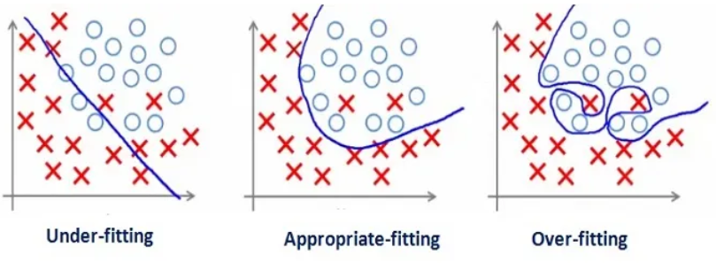
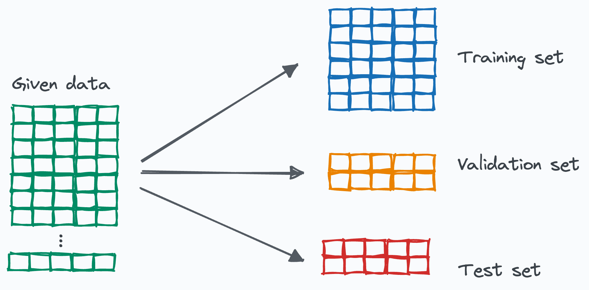
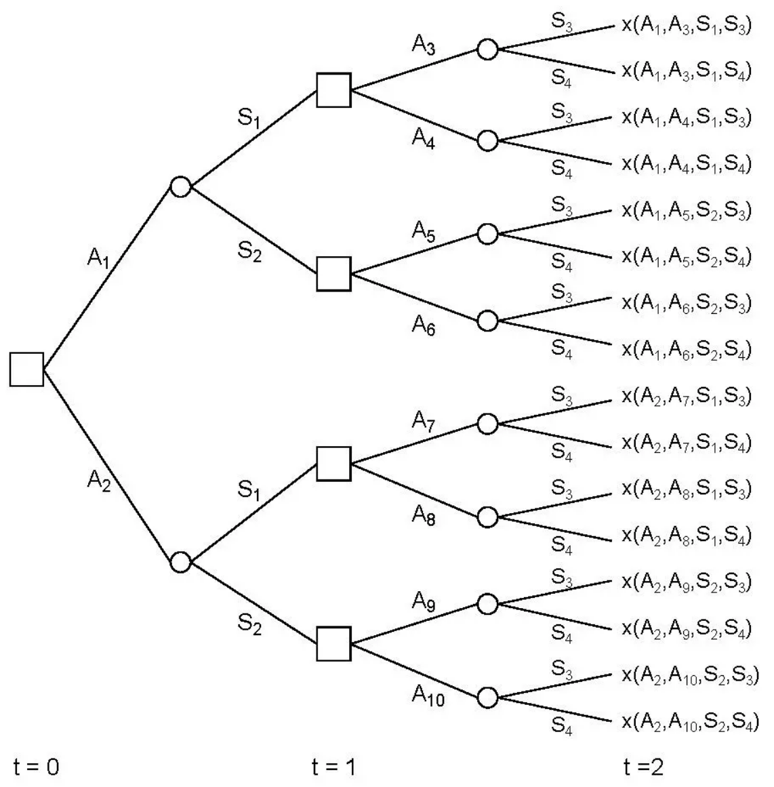
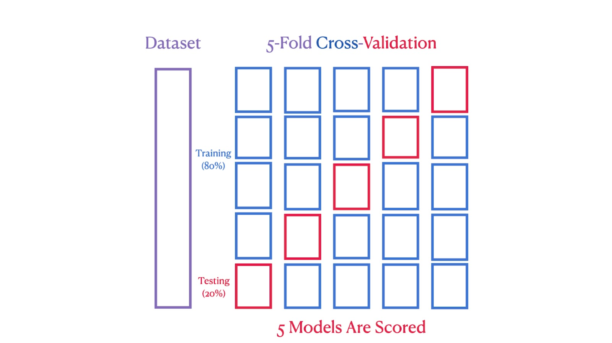

```{r setup, include=F}
#knitr::opts_chunk$set(fig.width = 6, message = F, warning = F, eval =F,
#                      comment = "", cache = F)
knitr::opts_chunk$set(fig.width = 6,  message = F, warning = F, eval =TRUE, cache = F)
library(knitr)
library(ggplot2)
```

## Überblick

- **Einführung: Von Statistik zu ML**
   - Was unterscheidet ML von klassischer Statistik?
   - Warum benötigen Ökonomen ML-Methoden?
- **Grundlegende Konzepte**
   - Der Trainings-Test-Split: Warum und wie?
   - Overfitting und Generalisierung
   - Der Bias-Varianz-Tradeoff
- **ML-Methoden für Vorhersageprobleme**
   - LASSO-Regression für Variablenselektion
   - Entscheidungsbäume und Random Forests
- **Fortgeschrittene Konzepte und Anwendungen**
   - Cross-Validation zur Modellvalidierung
   - Textanalyse mit LLMs für Ökonomen

---

class: inverse, center, middle

# Von klassischer Statistik zu maschinellem Lernen

---

## Was unterscheidet ML von klassischer Statistik?

.pull-left[
**Klassische Statistik/Ökonometrie**
- **Hauptziel**: Parameterschätzung ($\hat{\beta}$)
- **Fokus**: Kausalität und Inferenz
- **Theorie**: Modell basiert auf wirtschaftlicher Theorie
- **Evaluierung**: In-Sample-Anpassung, Signifikanztests
]

.pull-right[
**Maschinelles Lernen**
- **Hauptziel**: Vorhersagegenauigkeit ($\hat{Y}$)
- **Fokus**: Muster und Prognosen
- **Daten**: Modell wird von Daten geleitet
- **Evaluierung**: Out-of-Sample-Performance
]

.center[.alert[**Beide Ansätze ergänzen sich und sind nicht konkurrierend!**]]

---

## Terminologie: Statistik vs. ML

| Statistik | Machine Learning |
|-----------|------------------|
| Datenpunkt | Instance |
| Kovariate | Feature |
| Parameter | Weights |
| Schätzung | Learning |
| Regression/Klassifikation | Supervised Learning |
| Clustering | Unsupervised Learning |
| Response | Label |
| Testset-Performance | Generalization |

---

## Warum benötigen Ökonomen ML-Methoden?

- **Große Datensätze** mit vielen potenziellen Einflussvariablen
   - Administrative Daten
   - Web-gescrapte Daten
   - Hochfrequente Finanzdaten
- **Komplexe, nicht-lineare Zusammenhänge**
   - Wirtschaftliche Prozesse sind selten linear
   - Interaktionseffekte sind schwer zu modellieren
- **Verbesserte Vorhersagen**
   - Konjunkturprognosen
   - Risikomodelle
   - Kundenverhalten
- **Neue Datenquellen erschließen**
   - Textdaten (Zentralbankstatements, Nachrichten)
   - Bilder, Sensordaten

---

class: inverse, center, middle

# Von der Regression zum Maschinellen Lernen

---

## Vorhersageproblem und Modellgüte

**Ziel in der Regression**: $f(X) = E(Y|X)$ möglichst genau schätzen

**Evaluierung**: Wie gut sagt das Modell $\hat{f}(X)$ den wahren Wert $Y$ vorher?

**Mittlerer quadratischer Fehler (MSE)**:
$MSE = \frac{1}{n}\sum_{i=1}^n (y_i - \hat{f}(x_i))^2$

**Aber**: MSE auf den Trainingsdaten ist irreführend! Warum?

---

## Das Problem: Overfitting

.pull-left[
**Was ist Overfitting?**
- Modell "lernt" die Trainingsdaten zu genau
- Erfasst nicht nur die echten Muster, sondern auch das Rauschen
- Folge: Schlechte Generalisierung auf neue Daten

**Beispiel: Polynomiale Regression**
- Lineares Modell: Underfitting (zu simpel)
- Quadratisches Modell: Gute Balance
- Polynom 10. Grades: Overfitting (zu komplex)
]

.pull-right[
```{r, echo=FALSE, fig.align='center', out.width='100%'}

```

[Bildquelle](https://medium.com/ml-research-lab/under-fitting-over-fitting-and-its-solution-dc6191e34250)
]

---

## Die Lösung: Trainings- und Testdaten

.pull-left[
**Warum aufteilen?**
- **Trainingsdaten**: Zum Schätzen der Modellparameter
- **Testdaten**: Zur unabhängigen Bewertung der Generalisierbarkeit

**Vorgehensweise:**
- Zufällige Aufteilung der Daten (z.B. 80/20)
- Training des Modells nur auf Trainingsdaten
- Evaluation der Performance auf Testdaten
]

.pull-right[
```{r, echo=FALSE, fig.align='center', out.width='70%'}

```
[Bildquelle](https://blog.dailydoseofds.com/p/how-to-actually-use-train-validation)

```{r, eval=FALSE}
# Beispiel in R mit tidymodels
library(tidymodels)

# Daten aufteilen
data_split <- initial_split(data, prop = 0.8)
train_data <- training(data_split)
test_data <- testing(data_split)
```
]

---

## Der Bias-Varianz-Tradeoff

**Erwarteter Vorhersagefehler** kann zerlegt werden in:

$$E[(y - \hat{f}(x))^2] = \text{Bias}^2[\hat{f}(x)] + \text{Var}[\hat{f}(x)] + \sigma^2$$

- **Bias**: Systematische Abweichung des Modells
  - Hoher Bias $\rightarrow$ Underfitting (zu einfaches Modell)
- **Varianz**: Empfindlichkeit gegenüber Schwankungen in den Trainingsdaten
  - Hohe Varianz $\rightarrow$ Overfitting (zu komplexes Modell)
- **Irreduzibler Fehler** ($\sigma^2$): Unvermeidbare Unsicherheit

---

## Visualisierung des Bias-Varianz-Tradeoffs

```{r, echo=FALSE, fig.align='center', out.width='50%'}
include_graphics("figs/Bias_Variance.svg")
```
[Bildquelle](https://en.wikipedia.org/wiki/Bias%E2%80%93variance_tradeoff)

- **Modellkomplexität erhöhen**: Bias $\downarrow$, Varianz $\uparrow$
- **Modellkomplexität verringern**: Bias $\uparrow$, Varianz $\downarrow$

**Ziel**: Optimaler Punkt mit minimalem Gesamtfehler

---

class: inverse, center, middle

# ML-Methoden für Vorhersageprobleme

---

## Lineare Regression als Ausgangspunkt

**Klassisches lineares Modell:**
$$y_i = \beta_0 + \beta_1 x_{i1} + \beta_2 x_{i2} + ... + \beta_p x_{ip} + \varepsilon_i$$
**Eigenschaften:**
- Einfach zu interpretieren: $\beta_j$ ist der Effekt von $x_j$ auf $y$
- Leicht zu schätzen: Kleinste-Quadrate-Methode (OLS)
- Schnell berechenbar, auch für große Datensätze

**Limitierungen:**
- Kann nicht-lineare Beziehungen nur begrenzt erfassen
- Bei vielen Variablen: Gefahr von Überanpassung und Multikollinearität
- Keine automatische Variablenselektion

---

## LASSO: Regularisierung für bessere Modelle

LASSO (Least Absolute Shrinkage and Selection Operator) erweitert die lineare Regression:

$$\hat{\beta} = \min_{\beta} \sum_{i=1}^n (y_i - \beta_0 - \sum_{j=1}^p \beta_j x_{ij})^2 + \lambda \sum_{j=1}^p |\beta_j|$$

- Der Regularisierungsparameter $\lambda \sum_{j=1}^p |\beta_j|$ kontrolliert die Größe der Koeffizienten
- $\lambda$ kontrolliert, wie stark die Regularisierung ist
- Für $\lambda$ = 0 landen wir bei der linearen Regression

**Vorteile:**
- **Variablenselektion**: Unwichtige Koeffizienten werden auf 0 gesetzt
- **Regularisierung**: Verhindert Overfitting durch Einschränkung der Koeffizienten
- **Bessere Vorhersagen**: Besonders bei vielen potenziellen Prädiktoren
- **Interpretierbarkeit**: Ergebnis bleibt ein lineares Modell

---

## LASSO in der Praxis mit tidymodels

.small[
```{r, eval=FALSE}
# LASSO in R mit dem tidymodels-Framework
library(tidymodels)

# Daten aufteilen
data_split <- initial_split(economic_data, prop = 0.8)
train_data <- training(data_split)
test_data <- testing(data_split)

# Rezept für Datenvorverarbeitung
lasso_recipe <- recipe(target ~ ., data = train_data) |>
  step_normalize(all_numeric_predictors()) |>  # Wichtig für LASSO!
  step_dummy(all_nominal_predictors()) |>
  step_zv(all_predictors())

# LASSO-Modell spezifizieren
lasso_spec <- linear_reg(
  penalty = 0.1,    # Lambda-Parameter für Regularisierung
  mixture = 1       # 1 = LASSO, 0 = Ridge, dazwischen = Elastic Net
) |>
  set_engine("glmnet")

# Workflow erstellen und anpassen
lasso_workflow <- workflow() |>
  add_recipe(lasso_recipe) |>
  add_model(lasso_spec) |>
  fit(train_data)
```
]

---

## Entscheidungsbäume: Intuitive nicht-lineare Modelle

**Grundidee:**
- Daten werden durch eine Reihe von binären Entscheidungen aufgeteilt
- Jede Aufteilung maximiert die Homogenität der Untergruppen
- Blätter enthalten die Vorhersagen für die jeweiligen Segmente

**Vorteile:**
- Erfassen automatisch nicht-lineare Beziehungen und Interaktionen
- Leicht zu interpretieren (visuelle Darstellung möglich)
- Können mit kategorialen und numerischen Variablen umgehen
- Robust gegenüber Ausreißern und fehlenden Werten

---

## Beispiel eines Entscheidungsbaums

.pull-left[
```{r, echo=FALSE, fig.align='center', out.width='80%'}

```
[Bildquelle](https://wirtschaftslexikon.gabler.de/definition/entscheidungsbaum-35225)
]

.pull-right[
```{r, eval=FALSE}
# Entscheidungsbaum in R
library(rpart)
library(rpart.plot)

# Modell erstellen
tree_model <- rpart(income ~ education + experience + age + sector, 
                   data = economic_data, 
                   method = "anova")  # für Regression

# Visualisierung des Baums
rpart.plot(tree_model, box.palette = "RdBu", shadow.col = "gray")
```
]

---

## Entscheidungsbäume: Funktionsweise im Detail

- **Aufteilung finden:**
   - Für jede Variable und jeden möglichen Schwellenwert:
     - Berechne Unreinheit der resultierenden Teilmengen
     - Wähle Split, der Unreinheit am meisten reduziert
- **Unreinheitsmaße:**
   - Regression: Varianz oder mittlerer quadratischer Fehler
   - Klassifikation: Gini-Index oder Entropie
- **Stopping-Kriterien:**
   - Maximale Tiefe erreicht
   - Minimale Anzahl an Beobachtungen pro Blatt
   - Keine signifikante Verbesserung mehr möglich

---

## Random Forests: Von einzelnen Bäumen zu Wäldern

**Problem von einzelnen Entscheidungsbäumen:**
- Hohe Varianz: Kleine Änderungen in den Daten können zu sehr unterschiedlichen Bäumen führen
- Neigung zum Overfitting bei zu tiefen Bäumen

**Lösung - Random Forests:**
- Erstelle viele Entscheidungsbäume (oft 100-500)
- Jeder Baum wird auf einer Bootstrap-Stichprobe trainiert (Bagging)
- Bei jedem Split nur zufällige Teilmenge der Variablen betrachten (Feature Bagging)
- Kombiniere die Vorhersagen aller Bäume (Durchschnitt oder Mehrheitsentscheid)

---

## Random Forests: Eigenschaften und Vorteile

**Eigenschaften:**
- **Robust**: Weniger anfällig für Overfitting als einzelne Bäume
- **Genau**: Oft bessere Vorhersagen als einzelne Modelle
- **Stabil**: Geringe Varianz durch Mittelung vieler Bäume
- **Flexibel**: Automatische Erfassung von Nicht-Linearitäten und Interaktionen

**Nachteile:**
- Weniger interpretierbar als einzelne Bäume
- Berechnungsintensiver
- Kann "Black-Box"-Charakter haben

---

## Random Forests in der Praxis

```{r, eval=FALSE}
# Random Forest mit tidymodels
library(tidymodels)

# Modell spezifizieren
rf_spec <- rand_forest(
  trees = 500,                # Anzahl der Bäume
  mtry = tune(),              # Anzahl der Variablen pro Split (zu optimieren)
  min_n = tune()              # Minimale Knotengröße (zu optimieren)
) |>
  set_engine("ranger") |>    # Schnelle Implementation
  set_mode("regression")      # Für Regressionsprobleme

# Workflow erstellen
rf_workflow <- workflow() |>
  add_recipe(recipe(target ~ ., data = train_data)) |>
  add_model(rf_spec)

# Für Modelltuning siehe späteren Teil über Cross-Validation
```

---

class: inverse, center, middle

# Modellvalidierung und neue Anwendungsgebiete

---

## Warum eine einzelne Train-Test-Aufteilung nicht ausreicht

**Probleme der einfachen Aufteilung:**
- **Zufälligkeit**: Ergebnisse hängen stark von der spezifischen Aufteilung ab
- **Datenverschwendung**: Testdaten werden nur zur Evaluation, nicht zum Training verwendet
- **Parametertuning**: Wie Hyperparameter optimieren, ohne Testdaten zu "verbrauchen"?

**Beispiel für Hyperparameter:**
- LASSO: Regularisierungsparameter $\lambda$
- Random Forest: Anzahl der Bäume, Tiefe der Bäume, Anzahl der Variablen pro Split

---

## Cross-Validation: Robuste Modellvalidierung

.pull-left[
**K-Fold Cross-Validation:**
- Teile Trainingsdaten in K gleichgroße Teile (Folds)
- Für jedes Fold i (i=1...K):
   - Trainiere auf allen Daten außer Fold i
   - Evaluiere auf Fold i
- Mittlere Performance über alle K Folds
]

.pull-right[
```{r, echo=FALSE, fig.align='center', out.width='90%'}

```
[Bildquelle](https://www.datacamp.com/de/tutorial/k-fold-cross-validation)
]

**Vorteile:**
- Robustere Schätzung der Modellgüte
- Effiziente Nutzung der verfügbaren Daten
- Bessere Generalisierbarkeit der Ergebnisse

---

## Cross-Validation für Hyperparameter-Tuning

.small[
```{r, eval=FALSE}
# Hyperparameter-Tuning mit Cross-Validation
library(tidymodels)

# Kreuzvalidierung definieren
cv_folds <- vfold_cv(train_data, v = 10)  # 10-Fold CV

# Tuning-Grid für LASSO-Regularisierungsparameter
lambda_grid <- grid_regular(
  penalty(range = c(-3, 1), trans = log10_trans()),
  levels = 50
)

# Tuning durchführen
tuning_results <- lasso_workflow |>
  tune_grid(
    resamples = cv_folds,
    grid = lambda_grid,
    metrics = metric_set(rmse, rsq)
  )

# Besten Parameter auswählen
best_params <- select_best(tuning_results, "rmse")

# Finales Modell trainieren
final_model <- finalize_workflow(lasso_workflow, best_params) |>
  fit(train_data)
```
]

---

## Beispielhafte Anwendungen: Textanalyse

**Traditionelle Ökonomie:**
- Fokus auf strukturierte, quantitative Daten
- Qualitative Informationen oft vernachlässigt

**Neue Möglichkeiten durch Textanalyse:**
- Analyse von Zentralbankstatements
- Sentimentanalyse von Wirtschaftsnachrichten
- Auswertung von Geschäftsberichten
- Analyse von Kundenrezensionen

**Methoden:**
- Bag-of-Words und TF-IDF
- Topic Modeling
- Word Embeddings
- **Large Language Models (LLMs)**

---

## Large Language Models (LLMs) für Ökonomen

**Was sind LLMs?**
- Transformer-basierte Modelle, trainiert auf riesigen Textmengen
- Erkennen komplexe Zusammenhänge und Kontexte in Texten
- Beispiele: GPT, Claude, Gemini

**Anwendungsmöglichkeiten in der Ökonomie:**
- **Informationsextraktion** aus komplexen Dokumenten
- **Sentimentanalyse** mit feiner Granularität
- **Szenarioanalyse** und Prognosegenerierung
- **Forschungsunterstützung** (Literaturzusammenfassungen, Hypothesengenerierung)

---

## LLMs in R nutzen mit dem ellmer-Paket

```{r, eval=FALSE}
# Installation des ellmer-Pakets
install.packages("ellmer")
library(ellmer)

# API-Schlüssel in .Renviron speichern (sicher)
# usethis::edit_r_environ()
# Füge hinzu: GOOGLE_API_KEY=IhrApiSchlüssel

# Chat mit Google Gemini initialisieren
gemini_chat <- chat_gemini(
  system_prompt = "Du bist ein Ökonom, der bei der Analyse von Wirtschaftsdaten hilft.",
  model = "gemini-2.0-flash"
)

# Beispielanfrage stellen
response <- gemini_chat$chat(
  "Analysiere folgende Konjunkturdaten und erstelle eine Prognose für das nächste Quartal..."
)
```

---

## Zusammenfassung: Wichtige Erkenntnisse für Ökonomen

**Kernprinzipien des ML nach Breiman (2001)**

- **Rashomon-Effekt**:
   - Viele unterschiedliche Modelle können ähnlich gute Vorhersagen liefern
   - Vorsicht bei kausaler Interpretation von Modellparametern
- **Occam-Prinzip**:
   - Einfache, transparente Modelle sind oft weniger präzise
   - Abwägung zwischen Interpretierbarkeit und Vorhersagegenauigkeit
- **Bellman-Prinzip**:
   - Hohe Dimensionalität kann in ML vorteilhaft sein
   - ML-Methoden können viele Prädiktoren effektiv nutzen

---

## Methoden im Vergleich: Stärken und Schwächen

| Methode           | Vorteil                                | Nachteil                          | Typische Anwendung                      |
|-------------------|---------------------------------------|-----------------------------------|----------------------------------------|
| LASSO             | Interpretierbar, Variablenselektion   | Limitiert bei Nichtlinearität     | Makroökonomische Prognosen, Faktorselektion |
| Entscheidungsbäume| Intuitive Visualisierung, transparent | Instabil, Tendenz zum Overfitting | Kreditscoring mit erklärbaren Regeln   |
| Random Forest     | Flexibel, robuste Prognosen          | Schwerer interpretierbar          | Kreditrisiko-Modellierung, Preisvorhersagen |
| LLMs              | Tiefes Textverständnis               | Black-Box, Ressourcenintensiv     | Sentimentanalyse, Informationsextraktion |

---

## Schlüssel zum Erfolg mit ML in der Ökonomie

- **Methodenauswahl nach Anwendungsfall**:
   - Prognose vs. Kausalanalyse
   - Interpretierbarkeit vs. Genauigkeit
- **Robuste Validierung**:
   - Immer Out-of-Sample Performance prüfen
   - Kreuzvalidierung für Hyperparameter-Optimierung
- **Feature Engineering**:
   - Domänenwissen einbringen
   - Ökonomische Theorie als Leitfaden
- **Kombination von Methoden**:
   - Strukturelle Modelle + ML-Komponenten
   - Double/Debiased Machine Learning für Kausalinferenz (weiterführende Literatur)

---

## Empfohlene Literatur zur Vertiefung

- Athey, S., & Imbens, G. W. (2019). Machine learning methods that economists should know about. Annual Review of Economics, 11(1), 685-725.
- Mullainathan, S., & Spiess, J. (2017). Machine learning: an applied econometric approach. Journal of Economic Perspectives, 31(2), 87-106.
- Varian, H. R. (2014). Big data: New tricks for econometrics. Journal of economic perspectives, 28(2), 3-28.
- Breiman, L. (2001). Statistical modeling: The two cultures (with comments and a rejoinder by the author). Statistical science, 16(3), 199-231.

---

## R-Pakete für ML in der Ökonomie

- **tidymodels**: Framework für moderne ML-Workflows
- **glmnet**: Penalisierte Regression (LASSO, Ridge, Elastic Net)
- **randomForest** und **ranger**: Schnelle Random Forest Implementierungen
- **DoubleML**: Implementierung von Double/Debiased Machine Learning
- **ellmer**: R-Integration für LLMs (GPT, Claude, Gemini, etc.)
